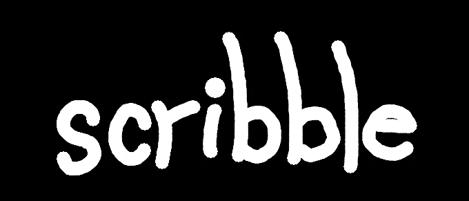

<p>a lightweight app for scribbling unimportant drawings quickly</p>

## Building / Running

scribble uses [Ebitengine](https://ebitengine.org/), follow their installation guides for you OS [here](https://github.com/hajimehoshi/ebiten?tab=readme-ov-file#platforms) before cloning this repository.

Afterwards:

```bash
git clone https://github.com/Cartermel/scribble.git
cd scribble
# -o scribble.exe for windows
go build -o scribble ./main
```
